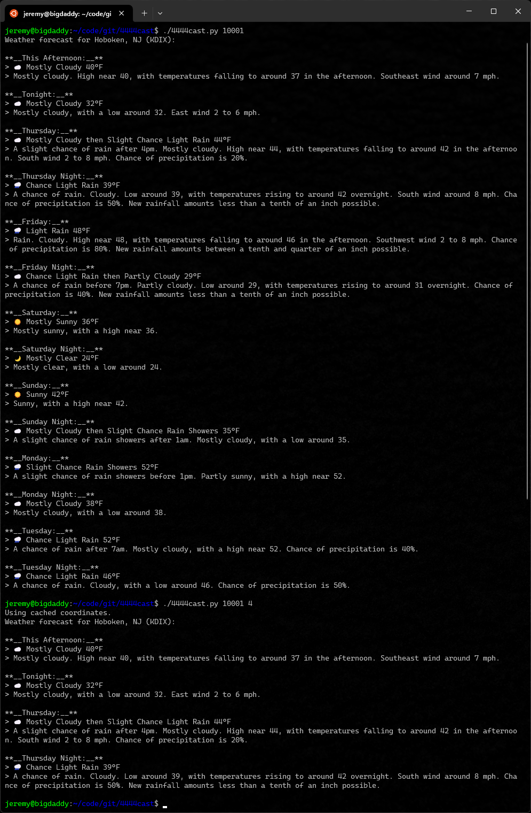

# 4444cast
Playing around with geolocation and weather APIs. This is shite as a shareable script, because it requires a Google Cloud account to access the Google Maps API.

## Setup:
1. Clone repo to a location of your choosing,
2. Create '.google_api_key' in the same directory, and add Google Maps API key to the file on a single line,
3. Enjoy.

## Usage:
```
  ./4444cast.py zip_code [limit]
```
## Demo:
:bulb: Script output is in markdown for piping into chat client webhooks. This will be configurable via command line flag later.



## TODO:
- [x] Add local caching of ZIP/lat/long to greatly reduce Google Maps API calls
- [x] Re-write in Python, for great learning.
  - [x] Implement API retries
- [ ] Make markdown output optional
- [ ] \(Stretch\) Re-write in Rust/Golang, for greater learning.
