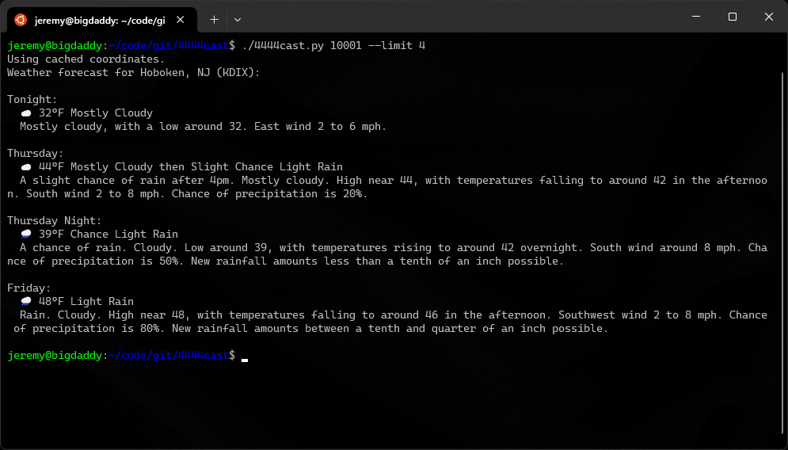

# 4444cast
Playing around with geolocation and weather APIs. Markdown output is optional, and is included because I use this in a cron job to send the weather to a Discord webhook.

## Setup:
1. Clone repo to a location of your choosing,
2. `pip3 install -r requirements.txt`
2. Enjoy.

## Usage:
```
  ./4444cast.py [-h] [--limit/-l LIMIT] [--markdown/-m] zip_code
```
## Demo:




## TODO:
- [x] Add local caching of ZIP/lat/long to greatly reduce Google Maps API calls
- [x] Re-write in Python, for great learning.
  - [x] Implement API retries
- [x] Make markdown output optional
- [ ] \(Stretch\) Re-write in Rust/Golang, for greater learning.
