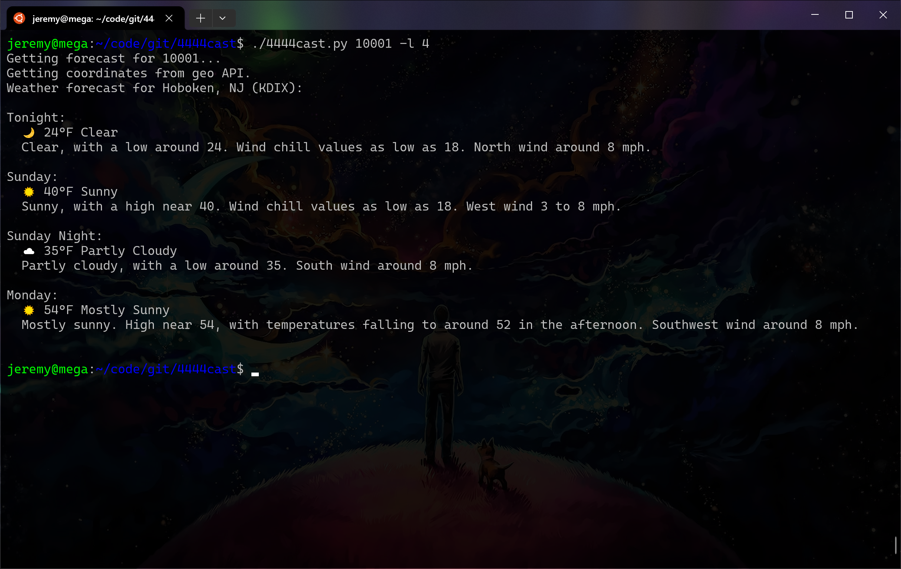
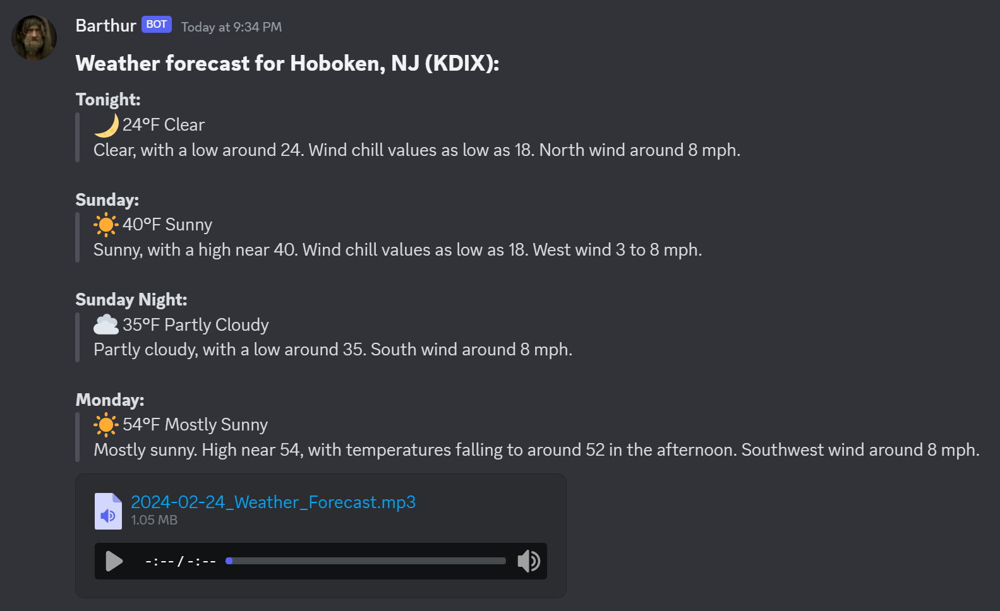

# 4444cast
**4444cast.py** is a Python script that provides a weather forecast. It polls the National Weather Service (NWS) weather forecast data for a provided ZIP code. The ZIP code is translated to geo coordinates via [zippopotam.us](https://api.zippopotam.us/) - no API key required.

For added fun, Discord webhook support is included. Simply use the `-d [webhook_url]` option and the forecast will be sent to the webhook, or provide a comma-separated list of webhooks to send the forecast to multiple. For extra, extra fun, you can have the OpenAI text-to-speech (TTS) API summarize and dictate the forecast. Use the `-o [openai_api_key]` option, and an MP3 recording will be attached to the forecast sent to Discord. [Click here](doc/tts-demo.mp3) for a sample audio clip.

The [original version](https://github.com/jlyons210/4444cast/tree/579146f38fe8dbb653d56e8a9f2281de0cb1ae29) of this repo implemented very basic functionality as a shell script. It worked well enough for a while, but I didn't implement HTTP retries, and decided to re-write this in Python. Other features described above started me down a more fun path.

I wanted to retain its original functionality, so it is still possible to run as a standalone CLI program. Discord and OpenAI functions are optional. Optional markdown output prettifies Discord channel output.

## Setup:
1. Clone repo to a location of your choosing,
2. `pip3 install -r requirements.txt`
2. Enjoy.

## Usage:
```
usage: ./4444cast.py [-h, --help] [-l, --limit LIMIT] [-m, --markdown] [-o, --openai-api-key OPENAI_API_KEY]
                     [-d, --discord-webhook-urls DISCORD_WEBHOOK_URLS]
                     zip_code
```
## Demo:

### Running the script with only a ZIP code (limit 4 periods) will produce basic weather output:
```sh
./4444cast.py 10001 -l 4
```


### Running the script with Discord output and OpenAI audio summarization:
```sh
./4444cast.py 10001 -l 4 -m -d [discord_webhook] -o [opanai_api_key]
```


